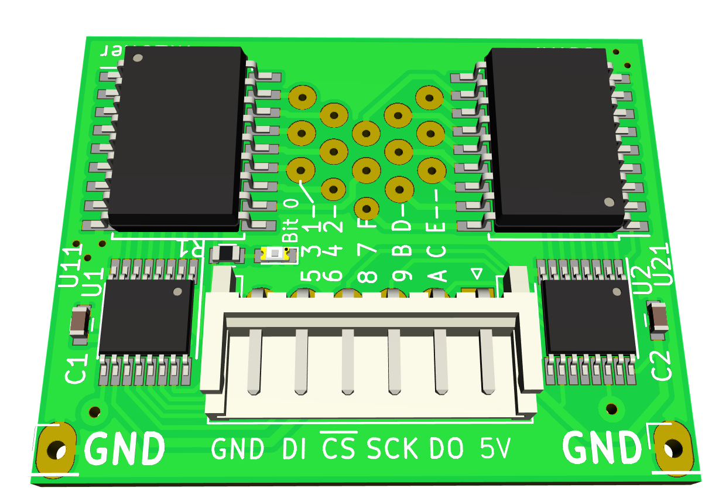

<p align="center">
</p>

<h1 align="center">an Open Source Hardware tactile display for the blind.</h1>

## Seeing for the blind: make it tactile
Without optical sense there is another way of conveying spatial information
in an accessible way by providing a [tactile experience][tactile-graphic].
Usually, these are 'offline' methods by using swell papers or embossers to
generate a surface representing graphics.

I wanted to make a "display" that can provide such tactile surface directly from
the computer. Of course, it would be a huge effort (and pretty heavy) to build
a surface with tens of thousands of actuators to poke out little dots, so
instead let's just strap a small amount of actuated dots just covering the
fingertip under the finger and actuate them depending on where the finger is
in the image. A display for the blind, let's call it **blisplay**.

#### About this README

I have to apologize to visually impaired readers of this README as it
contains are a couple of pictures in here which make it less accessible.
But these hopefully help your sighted peers to get them started
building the device. To make up for it, there are some explanations that
might sound lengthy and detailed to sighted readers - these are part of the
proverbial thousand words describing the pictures.

#### Direct optical to tactile

There is a simple direct way to do it: mount a camera under the set of tactile
pixels, watching the optical image underneath, directly translating optical
to tactile information; while moving the finger over the surface, the image
underneath will be translated to tactile information, allowing the user to
experience the full image by following the lines on the surface. This is the
first implementation as it is straightforward.

So the first prototype is sitting on a stand-off to be able to watch the
surface underneath.

![Rendering of a fully assembled unit][img-render-oblique]  |
   ![Photo of prototype unit][img-photo-oblique]
-----------------------------------|-------------------------|
Blisplay assembly rendering        | Photo of the actual unit|


#### Display an image from a computer

Another way is to show a picture directly from a computer by having it watch
the position of the finger and present the pixels representing the current
covered area. There are various ways doing it, e.g. with a graphic tablet
encoding the absolute position. Or, these days, it should be easy with the
ubiquitous smart-phones: load an image on the phone and point its camera to
the surface the hand is moving over; with simple image processing, we can
follow the finger relative to the background and send the right tactile
pattern to the device.

### Design goal
The design goal of this project is to make it simple to build
by some technically inclined person for their blind peers.

Right now, I am working on hashing out the most practical way to do so. The
first prototype is already pretty simple, but some more simplification
needs to be done (in particular for the coil wiring, see below).

I would hope for build parties in the future in which hacker-spaces
build devices for their local blind community and improve on the design based
on the feedback.

### Status
The first prototype is assembled and shows desirable functionality and force
of the actuators. The ADNS-3050 chip used as camera is connected but has yet
to be debugged to get some reading of the frame; also the lens-assembly for
getting an image on the sensor has to be worked on.

The current device is a little bit bulky (about 45mmx90mm), but ideas lined-up
for a second prototype will reduce that. Current resolution is about 2mm in a
4x6 grid (8mm x 12mm). This is already pretty close to the spacial resolution of
finger-tips, but future iterations will hopefully improve that more.

### History
What motivated all this ? I have a blind friend for whom I made tactile maps
by gluing thread on paper or transferring graphics using swell-paper
as well as other means to make graphical things accessible.
But in particular I wanted to directly provide images from a computer without
these detours.

In about 2006, I made the very first prototype of this project of a location
aware pixel actuator, [using a modified relay solenoid strapped to a pen of a
graphics tablet](./img/old-prototype-2006.jpg). The single pixels was not very
intuitive though as it requires a lot of scanning by finger. Fast forward do
2018, time to revisit this project and use 3D printing and hobbyist-affordable
PCB making that came up in the meantime to make this much more useful.

## Actuators

There are several ways we could think of actuating raising dots to get the
tactile experience. One of the most important constraints though will be size:
we need to have these pixels reasonably dense and a few of them to be able
to be useful. In the first prototype, these are 4x6 pixels in a 2mm grid
(somewhat diagonal grid as we see later). Also, ideally we can modulate the
force of the pixels to emulate different elevations.

The modulation constraint means that we can't use a bi-stable solenoid but
need to go with a moving coil or moving magnet approach.

The density constraint means that we need to optimize the use of the available
volume for the moving parts and keep supporting structure (magnets, wiring, ...)
out of the way.

### Moving coil
So let's just do the first and simplest thing that comes to mind: use a
conductor in a magnetic field, generating a [Lorentz force].
The conductor is made out of a PCB coil, essentially a square area with a
protruding bit on one side (the tactile dot) and a fulcrum in the
center other side.

#### Stack of flat coils in magnetic field
To visualize (sighted readers also see this in the images): Let's imagine
your left hand facing you with the thumb up.
The hand represents the flat coil with a conductor going across the index
finger towards your wrist, then down, and out again towards the pinkie.

The thumb is extended out and represents the little dot that will poke.
This coil/hand is hinged at the tip of the middle finger.
The magnetic field is going through the flat hand coming from the back of
your hand at the top and at the bottom into your hand pointing towards the back.

With a current through the conductor, the top conductor will move up and so will
the reversed bottom conductor through the reversed magnetic field. This coil
will hinge and move the thumb up and down.

With a stack of these coils, we can have a lot of actuators in a pretty dense
space. A stack of 12 coils are grouped in four stacks of three.
In each triplet, the first coil has the protruding dot the furthest away from
the fulcrum, the next 2mm in (as if the thumb was mounted more towards your
index finger), the next 4mm in.
That way, we can have three independently controlled pixels in that direction.
The coils are made of 0.4mm thick PCB, so the stack can be made 2mm thick with
some wiggle room to spare.
With four of these triplets, we have 4x3 pixels with a 2 mm distance between
adjacent pixels (but slightly diagonal due to the stacking).

In the following demonstration, the current direction is
shown in the traditional plus to minus direction to align with the common
Lorentz right-hand rule.

  ![Animation of forces in magnetic field][img-anim-lorentz] |
![A stack of three coils with offset fingers][img-triplet-coil] |
-----------------------------------------------|---------------------|
Moving coil in magnetic field. Blue arrow: static magnetic field; Red: current; Green: force | A triplet of coils with offset dots, stacked.


If we hinge two stacks right and left with the poky bits meeting at the center
we have a 6x4 pixel arrangement.

![Rendering showing view of actuators without magnets][img-render-no-magnets] |
  ![Closeup of pixels in prototype][img-photo-pixels]
-----------------------------------------------|---------------------|
View of all actuator blade coils.  | Closeup of pixels in prototype (here, only 22 pixels)

With each blade coil mounted, they can be individually controlled.

![Animation of pixels scanning and poking through finger-pad][img-anim-pixel-scan]

## Driving Circuit

The driving circuit for the coils are currently two identical boards with
a shift register and ULN2803 open collector driver chips. The two chained
boards are presenting itself as a 32 bit shift register to the microcontroller
and has two LEDs and allow to connect up to 30 coils. The
latch input is latching on the positive edge, so it can be used as an SPI
client.

The component choice was based on what I had lying around at home, but a
future iteration of this board will be more compact, e.g. by using
NCV7751 chips that contain 12 drivers and an SPI interface in one package.

 |
    
--------------------------------------|-----------------------------------|
15 Transistor serial driver board     |  ... for realz                    |

## Controlling Circuit
The controlling circuit right now is a simple ATTINY85 using SPI to
communicate with the driver circuit and the ADNS-3050. Two pins are used as
Chip Select for either the camera or the coil drivers.

This prototype is mounted on a raster board. The camera does not yet
have an optical lens assembly as the readout still needs to be debugged.

A future version will likely use a Microcontroller with more pins (ATTINY44) to
be able to also drive an additional 0.96" OLED display to help visualize while
debugging.

![Circuit from the bottom of the assembly][img-circuit]

# Building

Right now, the prototype design is still somewhat in flux, but you can already
build a prototype. Mail me directly if you have specific questions while doing
so.

### 3D printing and laser cutting

You need to have OpenSCAD installed, then, in the top-level directory, type

```
 make
```

This will generate the following files inside a `fab/` directory:

  * `print_yokes_magnetic_filament.stl` yokes to be printed with magnetic
    filament (I found that magnetic filament is actually not that good. I ended
    up printing them hollow and fill with iron powder. The next prototype will
    just use simple iron parts from the hardware store).
  * `print_yoke_spacers.stl` The spacers, to be printed with regular,
    non-magnetic filament.
  * `lasercut_sidewall.dxf` the side-wall to elevate the assembly to have a
    free view below. These dimensions are super rough right now and will change
    once there is a lens-assembly on the camera.
  * `finger_holder.stl` is a hollow shape keeping the finger in place over
    the actuators. You might need to adapt parameters to your finger-diameter.
    (currently does not lock into the rest of the assembly, you might need
    some double-sided tape).
  * The `assembly_tool_spacer_holder.stl` is not technically part of the
    blisplay, but a useful tool holding the parts while assembling.
  * In the top-level directory, there is also a PostScript file `coil-shape.ps`
    describing the coil shape, which is converted to a DXF file by the
    Makefile. That is used for the PCBs, but are also imported in the OpenSCAD
    model. Don't worry about these, the generated DXF file is also checked in.
  * For the assembly I am [using magnets][magnet-used] of size
    38.1mm x 6.35mm x 6.35mm.

### Printed circuit boards
Right now, there are two printed circuit boards.

  * The driver boards. These are in the [`driver-pcb/`](./driver-pcb)
    directory. These are likely to change to be more compact. [You can order
    them from OshPark][oshpark-driver] (not affiliated).
  * The coils: In the directory [`coil-pcb/`](./coil-pcb), you find the program
    to generate the coil footprint and a simple KiCAD project putting the
    coil shape and the coil footprint together. Future versions will have a
    slightly different shape (wedge form) and different connecting pads.
    Unfortunately, OshPark does not do 0.4mm thick PCBs, so you have to use
    some other PCB service to make these.
  * There is no microcontroller board yet, right now this is on a raster
    board. Once the optics is figured out, this (and possibly together with
    different driver chips) will be part of the next iteration.

### Wiring up the coils
Wiring up the coils is the most time-consuming currently. The coil-PCBs have
solder points to solder wires to, but just soldering on even a 0.1mm thick
enameled wire already makes them too thick to work well in the assembly.

So in the first iteration, I scratched a tiny groove with a scalpel into the
PCB, then embedded the enameled wire into that grove and soldered it flat
into there. Then insulation covered that with transformer lacquer.
Future experiments certainly will attempt to make this less tedious, e.g.
hot-bar flexible PCB on top of the board instead.

![Placing wire in groove][coil-groove]| ![finished coils][coil-finished]
--------------------------------------|-----------------------------------|
Placing a wire in groove              | finished coils

### Code
The code is in the src/ sub-directory. Build with the makefile there, then
flash using an Atmel programmer via avrdude (`make flash`).

# License
Any PCBs and 3D printed parts are Open Source Hardware licensed
with `CC-BY-SA` license. Any code is licensed with the GPL v3.

[logo]: ./img/blisplay-logo-medium.png
[img-render-oblique]: ./img/prototype-rendering.png
[img-photo-oblique]: ./img/prototype-photo.jpg
[img-render-no-magnets]: ./img/prototype-actuators-no-magnets.png
[img-photo-pixels]: ./img/photo-actuator-pixels.jpg
[img-anim-lorentz]: ./img/coil-lorentz-anim.gif
[img-triplet-coil]: ./img/triplet-stack.png
[img-anim-pixel-scan]: ./img/scan-pixel-anim.gif
[img-circuit]: ./img/prototype-circuit-view.jpg
[magnet-used]: https://www.kjmagnetics.com/proddetail.asp?prod=BX844
[tactile-graphic]: https://en.wikipedia.org/wiki/Tactile_graphic
[Lorentz force]: https://en.wikipedia.org/wiki/Lorentz_force
[oshpark-driver]: https://oshpark.com/shared_projects/nWsVpTrj
[coil-groove]: ./img/solder-wire-in-groove.jpg
[coil-finished]: ./img/soldered-coils.jpg